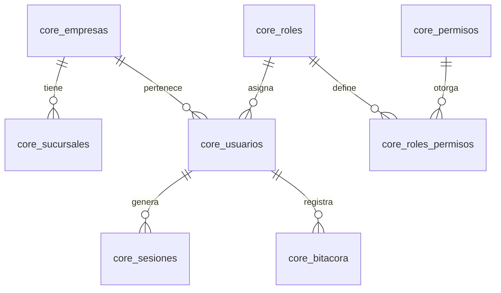
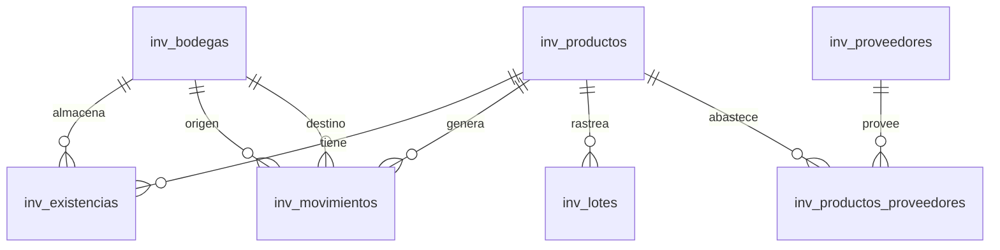
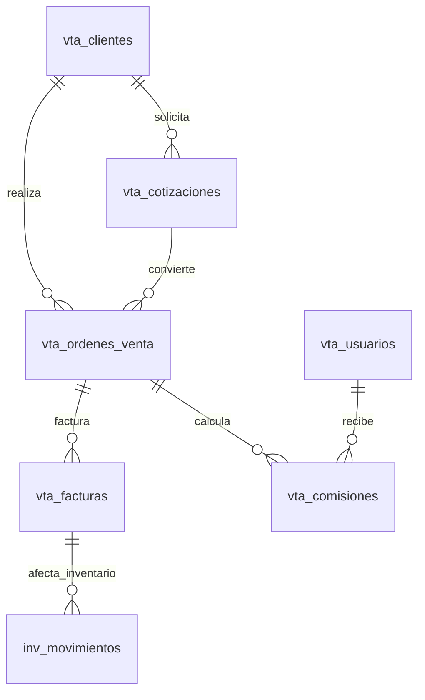
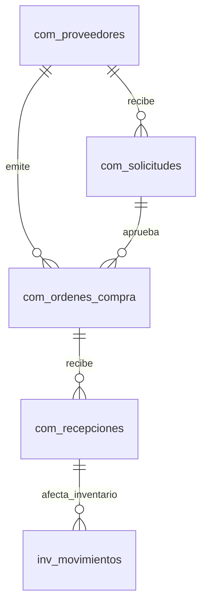
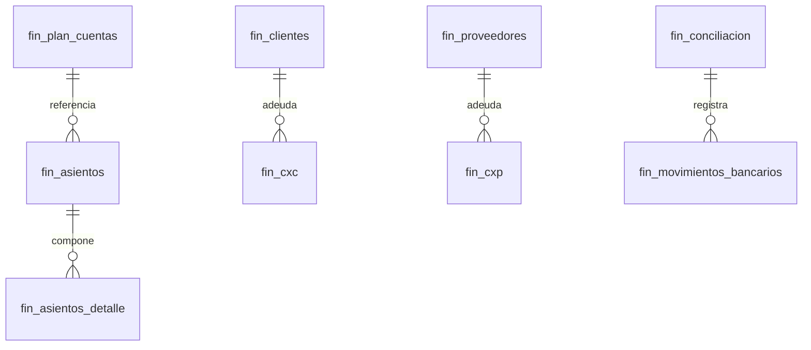
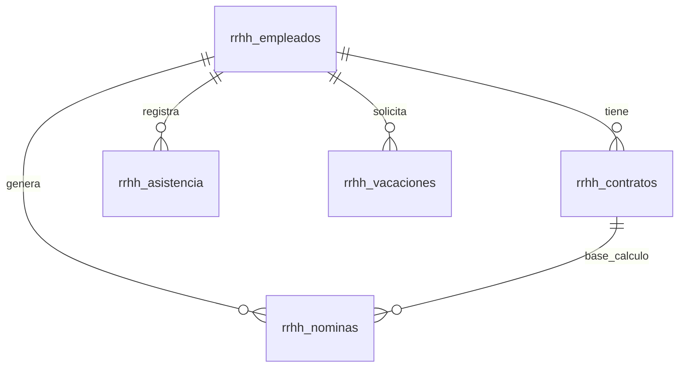
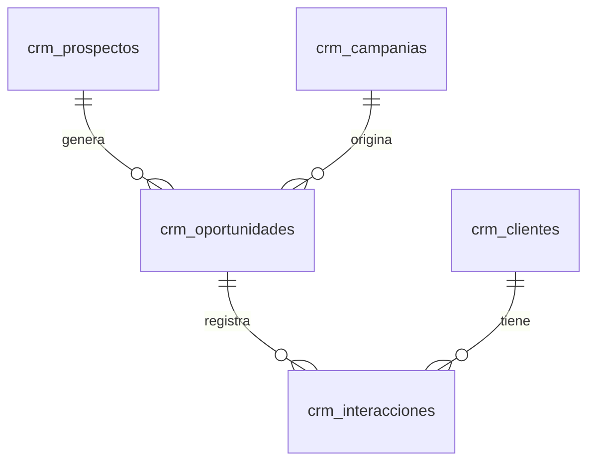
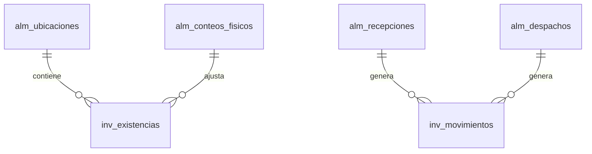

# ERD — Diseño Entidad-Relación del ERP GENS-OFFLINE

Basado en: `Requerimientos_ERP.md`, `Ruta_Implementacion_ERP.docx`, `Modulos_Futuros_ERP.docx`
Código existente: `servidor/src/database.js`, `servidor/src/routes/erp.js`

---

## Convenciones

- `id` en todas las tablas → `TEXT PRIMARY KEY` (UUID v4)
- `created_at` / `updated_at` → `TEXT` con formato ISO
- `activo` → `INTEGER DEFAULT 1` (soft delete)
- Las tablas existentes en `database.js` se **renombran/migran** donde sea necesario
- Prefijos: `core_`, `inv_`, `vta_`, `com_`, `fin_`, `rrhh_`, `crm_`, `alm_`

---

## 1. CORE — Núcleo del sistema

### 1.1 Entidades



#### core_empresas
| Columna | Tipo | Descripción |
|---------|------|-------------|
| id | TEXT PK | UUID |
| nombre | TEXT NOT NULL | Razón social |
| ruc | TEXT UNIQUE | RUC Panamá |
| schema_name | TEXT UNIQUE | Identificador multiempresa |
| logo_url | TEXT | |
| activo | INTEGER DEFAULT 1 | |
| config | TEXT DEFAULT '{}' | JSON con config general |
| created_at | TEXT | |

#### core_sucursales
| Columna | Tipo | Descripción |
|---------|------|-------------|
| id | TEXT PK | |
| empresa_id | TEXT FK → core_empresas.id | |
| nombre | TEXT NOT NULL | |
| direccion | TEXT | |
| telefono | TEXT | |
| activo | INTEGER DEFAULT 1 | |
| created_at | TEXT | |

#### core_roles
| Columna | Tipo | Descripción |
|---------|------|-------------|
| id | TEXT PK | |
| nombre | TEXT NOT NULL | ej: super_admin, admin, vendedor, bodeguero |
| descripcion | TEXT | |
| empresa_id | TEXT FK → core_empresas.id | NULL = global |
| created_at | TEXT | |

#### core_permisos
| Columna | Tipo | Descripción |
|---------|------|-------------|
| id | TEXT PK | |
| codigo | TEXT UNIQUE NOT NULL | ej: `inventario.ver`, `ventas.crear` |
| nombre | TEXT NOT NULL | |
| modulo | TEXT NOT NULL | inventario, ventas, compras, finanzas... |
| created_at | TEXT | |

#### core_roles_permisos
| Columna | Tipo | Descripción |
|---------|------|-------------|
| id | TEXT PK | |
| rol_id | TEXT FK → core_roles.id | |
| permiso_id | TEXT FK → core_permisos.id | |
| created_at | TEXT | |

#### core_usuarios (`← reemplaza tabla `usuarios``)
| Columna | Tipo | Descripción |
|---------|------|-------------|
| id | TEXT PK | |
| email | TEXT UNIQUE NOT NULL | |
| nombre | TEXT NOT NULL | |
| password | TEXT NOT NULL | bcrypt hash |
| rol_id | TEXT FK → core_roles.id | |
| empresa_id | TEXT FK → core_empresas.id | |
| sucursal_id | TEXT FK → core_sucursales.id | NULL = todas |
| activo | INTEGER DEFAULT 1 | |
| telefono | TEXT | |
| created_at | TEXT | |

#### core_sesiones (`← tabla `sesiones` existente, ok`)
| Columna | Tipo | Descripción |
|---------|------|-------------|
| id | TEXT PK | |
| usuario_id | TEXT FK → core_usuarios.id | |
| token | TEXT UNIQUE NOT NULL | JWT |
| expira_at | TEXT NOT NULL | |
| created_at | TEXT | |

#### core_bitacora (nueva)
| Columna | Tipo | Descripción |
|---------|------|-------------|
| id | TEXT PK | |
| usuario_id | TEXT FK → core_usuarios.id | |
| accion | TEXT NOT NULL | ej: `ventas.crear`, `usuario.login` |
| entidad | TEXT | tabla afectada |
| entidad_id | TEXT | ID del registro |
| detalle | TEXT | JSON con cambios |
| ip | TEXT | |
| created_at | TEXT | |

#### core_notificaciones (nueva)
| Columna | Tipo | Descripción |
|---------|------|-------------|
| id | TEXT PK | |
| usuario_id | TEXT FK → core_usuarios.id | NULL = todos |
| tipo | TEXT NOT NULL | email, push, in-app |
| titulo | TEXT NOT NULL | |
| mensaje | TEXT NOT NULL | |
| leida | INTEGER DEFAULT 0 | |
| modulo_origen | TEXT | |
| created_at | TEXT | |

#### core_configuracion (nueva — reemplaza configuración dispersa)
| Columna | Tipo | Descripción |
|---------|------|-------------|
| id | TEXT PK | |
| empresa_id | TEXT FK → core_empresas.id | |
| clave | TEXT NOT NULL | ej: `moneda_base`, `itbms_default`, `formato_factura` |
| valor | TEXT NOT NULL | |
| created_at | TEXT | |

---

## 2. INVENTARIO (Módulo MVP)

### 2.1 Entidades



#### inv_productos (`← renombrado de `erp_productos``)
| Columna | Tipo | Descripción |
|---------|------|-------------|
| id | TEXT PK | |
| codigo | TEXT UNIQUE | SKU / código interno |
| nombre | TEXT NOT NULL | |
| descripcion | TEXT | |
| categoria | TEXT | |
| unidad | TEXT DEFAULT 'unidad' | unidad, kg, lb, caja, litro |
| precio_venta | REAL NOT NULL DEFAULT 0 | |
| costo | REAL NOT NULL DEFAULT 0 | costo promedio actual |
| metodo_valuacion | TEXT DEFAULT 'promedio' | `promedio`, `peps`, `ueps` |
| stock_minimo | REAL DEFAULT 0 | alerta |
| stock_maximo | REAL DEFAULT 0 | alerta |
| activo | INTEGER DEFAULT 1 | |
| imagen_url | TEXT | |
| created_at | TEXT | |

#### inv_bodegas (`← renombrado de `erp_bodegas``)
| Columna | Tipo | Descripción |
|---------|------|-------------|
| id | TEXT PK | |
| nombre | TEXT NOT NULL | |
| sucursal_id | TEXT FK → core_sucursales.id | |
| ubicacion | TEXT | dirección o referencia |
| activo | INTEGER DEFAULT 1 | |
| created_at | TEXT | |

#### inv_existencias (`← renombrado de `erp_inventario``)
| Columna | Tipo | Descripción |
|---------|------|-------------|
| id | TEXT PK | |
| producto_id | TEXT FK → inv_productos.id | |
| bodega_id | TEXT FK → inv_bodegas.id | |
| cantidad | REAL NOT NULL DEFAULT 0 | |
| updated_at | TEXT | |
| UNIQUE(producto_id, bodega_id) | | |

#### inv_movimientos (nueva — reemplaza lógica dispersa de entradas/salidas)
| Columna | Tipo | Descripción |
|---------|------|-------------|
| id | TEXT PK | |
| tipo | TEXT NOT NULL | `entrada`, `salida`, `transferencia`, `ajuste`, `conteo` |
| producto_id | TEXT FK → inv_productos.id | |
| bodega_id | TEXT FK → inv_bodegas.id | |
| bodega_destino_id | TEXT FK → inv_bodegas.id | NULL si no es transferencia |
| cantidad | REAL NOT NULL | positiva para entradas, negativa para salidas |
| costo_unitario | REAL | costo al momento del movimiento |
| referencia | TEXT | ej: `OC-001`, `FV-001`, `Ajuste manual` |
| usuario_id | TEXT FK → core_usuarios.id | |
| notas | TEXT | |
| created_at | TEXT | |

#### inv_lotes (nueva — trazabilidad)
| Columna | Tipo | Descripción |
|---------|------|-------------|
| id | TEXT PK | |
| producto_id | TEXT FK → inv_productos.id | |
| codigo_lote | TEXT NOT NULL | |
| fecha_vencimiento | TEXT | NULL para productos sin vencimiento |
| cantidad_inicial | REAL NOT NULL | |
| cantidad_actual | REAL NOT NULL | |
| bodega_id | TEXT FK → inv_bodegas.id | |
| created_at | TEXT | |

#### inv_productos_proveedores (nueva)
| Columna | Tipo | Descripción |
|---------|------|-------------|
| id | TEXT PK | |
| producto_id | TEXT FK → inv_productos.id | |
| proveedor_id | TEXT FK → inv_proveedores.id | |
| codigo_proveedor | TEXT | SKU del proveedor |
| precio_compra | REAL | |
| tiempo_entrega_dias | INTEGER | |
| created_at | TEXT | |

---

## 3. VENTAS (Módulo MVP)

### 3.1 Entidades



#### vta_clientes (`← renombrado de `erp_clientes``)
| Columna | Tipo | Descripción |
|---------|------|-------------|
| id | TEXT PK | |
| ruc | TEXT UNIQUE | |
| dv | TEXT | Dígito verificador (DGI Panamá) |
| nombre | TEXT NOT NULL | |
| email | TEXT | |
| telefono | TEXT | |
| direccion | TEXT | |
| credito_limite | REAL DEFAULT 0 | 0 = sin crédito |
| credito_disponible | REAL DEFAULT 0 | |
| tipo | TEXT DEFAULT 'contribuyente' | `contribuyente`, `consumidor_final`, `extranjero` |
| activo | INTEGER DEFAULT 1 | |
| created_at | TEXT | |

#### vta_cotizaciones (nueva)
| Columna | Tipo | Descripción |
|---------|------|-------------|
| id | TEXT PK | |
| numero | TEXT UNIQUE NOT NULL | `COT-{año}-{secuencia}` |
| cliente_id | TEXT FK → vta_clientes.id | |
| fecha | TEXT NOT NULL | |
| valida_hasta | TEXT | |
| items | TEXT NOT NULL DEFAULT '[]' | JSON array de items |
| subtotal | REAL DEFAULT 0 | |
| descuento | REAL DEFAULT 0 | |
| itbms | REAL DEFAULT 0 | |
| total | REAL DEFAULT 0 | |
| estado | TEXT DEFAULT 'activa' | `activa`, `vencida`, `convertida`, `cancelada` |
| notas | TEXT | |
| usuario_id | TEXT FK → core_usuarios.id | |
| created_at | TEXT | |

#### vta_ordenes_venta (nueva)
| Columna | Tipo | Descripción |
|---------|------|-------------|
| id | TEXT PK | |
| numero | TEXT UNIQUE NOT NULL | `OV-{año}-{secuencia}` |
| cliente_id | TEXT FK → vta_clientes.id | |
| cotizacion_id | TEXT FK → vta_cotizaciones.id | NULL si no viene de cotización |
| fecha | TEXT NOT NULL | |
| items | TEXT NOT NULL DEFAULT '[]' | JSON |
| subtotal | REAL DEFAULT 0 | |
| descuento | REAL DEFAULT 0 | |
| itbms | REAL DEFAULT 0 | |
| total | REAL DEFAULT 0 | |
| estado | TEXT DEFAULT 'pendiente' | `pendiente`, `aprobada`, `despachada`, `facturada`, `cancelada` |
| metodo_pago | TEXT | |
| vendedor_id | TEXT FK → core_usuarios.id | |
| notas | TEXT | |
| created_at | TEXT | |

#### vta_facturas (`← renombrado de `erp_facturas``)
| Columna | Tipo | Descripción |
|---------|------|-------------|
| id | TEXT PK | |
| numero | TEXT UNIQUE NOT NULL | `F-{año}-{secuencia}` |
| orden_venta_id | TEXT FK → vta_ordenes_venta.id | NULL |
| cliente_id | TEXT FK → vta_clientes.id | |
| fecha | TEXT NOT NULL | |
| tipo | TEXT DEFAULT 'factura' | `factura`, `nota_credito`, `nota_debito`, `ticket` |
| subtotal | REAL DEFAULT 0 | |
| itbms | REAL DEFAULT 0 | |
| descuento | REAL DEFAULT 0 | |
| total | REAL DEFAULT 0 | |
| estado | TEXT DEFAULT 'pendiente' | `pendiente`, `emitida`, `pagada`, `anulada` |
| cufe | TEXT | Código único de facturación DGI |
| items | TEXT NOT NULL DEFAULT '[]' | JSON |
| created_at | TEXT | |

#### vta_comisiones (nueva)
| Columna | Tipo | Descripción |
|---------|------|-------------|
| id | TEXT PK | |
| orden_venta_id | TEXT FK → vta_ordenes_venta.id | |
| vendedor_id | TEXT FK → core_usuarios.id | |
| porcentaje | REAL NOT NULL | |
| monto | REAL NOT NULL | |
| pagada | INTEGER DEFAULT 0 | |
| created_at | TEXT | |

---

## 4. COMPRAS (Módulo MVP)

### 4.1 Entidades



#### com_proveedores (`← renombrado de `erp_proveedores``)
| Columna | Tipo | Descripción |
|---------|------|-------------|
| id | TEXT PK | |
| ruc | TEXT UNIQUE | |
| nombre | TEXT NOT NULL | |
| email | TEXT | |
| telefono | TEXT | |
| direccion | TEXT | |
| plazo_pago_dias | INTEGER DEFAULT 30 | |
| activo | INTEGER DEFAULT 1 | |
| calificacion | INTEGER | 1-5 |
| created_at | TEXT | |

#### com_solicitudes_compra (nueva)
| Columna | Tipo | Descripción |
|---------|------|-------------|
| id | TEXT PK | |
| numero | TEXT UNIQUE NOT NULL | `SC-{año}-{secuencia}` |
| solicitante_id | TEXT FK → core_usuarios.id | |
| fecha | TEXT NOT NULL | |
| items | TEXT NOT NULL DEFAULT '[]' | JSON |
| estado | TEXT DEFAULT 'pendiente' | `pendiente`, `aprobada`, `rechazada`, `ordenada` |
| aprobador_id | TEXT FK → core_usuarios.id | NULL |
| fecha_aprobacion | TEXT | |
| notas | TEXT | |
| created_at | TEXT | |

#### com_ordenes_compra (nueva)
| Columna | Tipo | Descripción |
|---------|------|-------------|
| id | TEXT PK | |
| numero | TEXT UNIQUE NOT NULL | `OC-{año}-{secuencia}` |
| proveedor_id | TEXT FK → com_proveedores.id | |
| solicitud_id | TEXT FK → com_solicitudes_compra.id | NULL |
| fecha | TEXT NOT NULL | |
| fecha_estimada | TEXT | fecha estimada de entrega |
| items | TEXT NOT NULL DEFAULT '[]' | JSON |
| subtotal | REAL DEFAULT 0 | |
| itbms | REAL DEFAULT 0 | |
| total | REAL DEFAULT 0 | |
| estado | TEXT DEFAULT 'pendiente' | `pendiente`, `enviada`, `recibida_parcial`, `recibida`, `cancelada` |
| created_at | TEXT | |

#### com_recepciones (nueva)
| Columna | Tipo | Descripción |
|---------|------|-------------|
| id | TEXT PK | |
| orden_compra_id | TEXT FK → com_ordenes_compra.id | |
| fecha | TEXT NOT NULL | |
| items | TEXT NOT NULL DEFAULT '[]' | JSON con cantidades recibidas |
| bodega_id | TEXT FK → inv_bodegas.id | |
| usuario_id | TEXT FK → core_usuarios.id | |
| notas | TEXT | |
| created_at | TEXT | |

---

## 5. FINANZAS / CONTABILIDAD (Módulo MVP)

### 5.1 Entidades



#### fin_plan_cuentas (nueva — tabla maestra de contabilidad)
| Columna | Tipo | Descripción |
|---------|------|-------------|
| id | TEXT PK | |
| codigo | TEXT NOT NULL | ej: `1.01.01` |
| nombre | TEXT NOT NULL | ej: `Caja` |
| tipo | TEXT NOT NULL | `activo`, `pasivo`, `patrimonio`, `ingreso`, `gasto` |
| nivel | INTEGER DEFAULT 1 | 1=raíz, 2=grupo, 3=cuenta |
| padre_id | TEXT FK → fin_plan_cuentas.id | NULL para cuentas raíz |
| activo | INTEGER DEFAULT 1 | |
| created_at | TEXT | |

#### fin_asientos (nueva — reemplaza `cont_asientos` que es demasiado simple)
| Columna | Tipo | Descripción |
|---------|------|-------------|
| id | TEXT PK | |
| numero | TEXT UNIQUE NOT NULL | `AS-{año}-{secuencia}` |
| fecha | TEXT NOT NULL | |
| tipo | TEXT NOT NULL | `manual`, `venta`, `compra`, `nomina`, `cierre` |
| referencia | TEXT | ID del documento origen |
| descripcion | TEXT NOT NULL | |
| usuario_id | TEXT FK → core_usuarios.id | |
| created_at | TEXT | |

#### fin_asientos_detalle (nueva)
| Columna | Tipo | Descripción |
|---------|------|-------------|
| id | TEXT PK | |
| asiento_id | TEXT FK → fin_asientos.id | |
| cuenta_id | TEXT FK → fin_plan_cuentas.id | |
| debe | REAL DEFAULT 0 | |
| haber | REAL DEFAULT 0 | |
| created_at | TEXT | |

#### fin_cxc (nueva — Cuentas por Cobrar)
| Columna | Tipo | Descripción |
|---------|------|-------------|
| id | TEXT PK | |
| factura_id | TEXT FK → vta_facturas.id | |
| cliente_id | TEXT FK → vta_clientes.id | |
| monto | REAL NOT NULL | |
| saldo | REAL NOT NULL | monto - abonos |
| fecha_emision | TEXT NOT NULL | |
| fecha_vencimiento | TEXT NOT NULL | |
| estado | TEXT DEFAULT 'pendiente' | `pendiente`, `parcial`, `pagada`, `vencida` |
| created_at | TEXT | |

#### fin_cxp (nueva — Cuentas por Pagar)
| Columna | Tipo | Descripción |
|---------|------|-------------|
| id | TEXT PK | |
| oc_id | TEXT FK → com_ordenes_compra.id | |
| proveedor_id | TEXT FK → com_proveedores.id | |
| monto | REAL NOT NULL | |
| saldo | REAL NOT NULL | |
| fecha_emision | TEXT NOT NULL | |
| fecha_vencimiento | TEXT NOT NULL | |
| estado | TEXT DEFAULT 'pendiente' | `pendiente`, `parcial`, `pagada` |
| created_at | TEXT | |

#### fin_movimientos_bancarios (nueva — conciliación)
| Columna | Tipo | Descripción |
|---------|------|-------------|
| id | TEXT PK | |
| fecha | TEXT NOT NULL | |
| tipo | TEXT NOT NULL | `ingreso`, `egreso` |
| descripcion | TEXT NOT NULL | |
| monto | REAL NOT NULL | |
| referencia | TEXT | número de cheque o transacción |
| conciliado | INTEGER DEFAULT 0 | |
| cuenta_bancaria | TEXT | |
| created_at | TEXT | |

---

## 6. RRHH (Fase 3, pero Planilla ya existe)

### 6.1 Entidades



#### rrhh_empleados (nueva — reemplaza erp_planilla.empleado que es solo texto)
| Columna | Tipo | Descripción |
|---------|------|-------------|
| id | TEXT PK | |
| cedula | TEXT UNIQUE | |
| nombre | TEXT NOT NULL | |
| email | TEXT | |
| telefono | TEXT | |
| direccion | TEXT | |
| fecha_nacimiento | TEXT | |
| sexo | TEXT | |
| activo | INTEGER DEFAULT 1 | |
| created_at | TEXT | |

#### rrhh_contratos (nueva)
| Columna | Tipo | Descripción |
|---------|------|-------------|
| id | TEXT PK | |
| empleado_id | TEXT FK → rrhh_empleados.id | |
| tipo | TEXT NOT NULL | `indefinido`, `fijo`, `temporal` |
| cargo | TEXT NOT NULL | |
| salario_base | REAL NOT NULL | |
| forma_pago | TEXT DEFAULT 'mensual' | `mensual`, `quincenal`, `semanal` |
| fecha_inicio | TEXT NOT NULL | |
| fecha_fin | TEXT | NULL si indefinido |
| activo | INTEGER DEFAULT 1 | |
| created_at | TEXT | |

#### rrhh_asistencia (nueva)
| Columna | Tipo | Descripción |
|---------|------|-------------|
| id | TEXT PK | |
| empleado_id | TEXT FK → rrhh_empleados.id | |
| fecha | TEXT NOT NULL | |
| hora_entrada | TEXT | |
| hora_salida | TEXT | |
| tipo | TEXT DEFAULT 'normal' | `normal`, `permiso`, `vacacion`, `incapacidad` |
| created_at | TEXT | |

#### rrhh_vacaciones (nueva)
| Columna | Tipo | Descripción |
|---------|------|-------------|
| id | TEXT PK | |
| empleado_id | TEXT FK → rrhh_empleados.id | |
| fecha_inicio | TEXT NOT NULL | |
| fecha_fin | TEXT NOT NULL | |
| dias | INTEGER NOT NULL | |
| estado | TEXT DEFAULT 'pendiente' | `pendiente`, `aprobada`, `rechazada`, `tomada` |
| created_at | TEXT | |

#### rrhh_nominas (`← renombrado de `erp_planilla``)
| Columna | Tipo | Descripción |
|---------|------|-------------|
| id | TEXT PK | |
| empleado_id | TEXT FK → rrhh_empleados.id | |
| contrato_id | TEXT FK → rrhh_contratos.id | |
| periodo | TEXT NOT NULL | ej: `2026-01` |
| salario_base | REAL NOT NULL | |
| horas_extra | REAL DEFAULT 0 | |
| bonos | REAL DEFAULT 0 | |
| deducciones | REAL DEFAULT 0 | |
| seguro_social | REAL DEFAULT 0 | |
| total | REAL NOT NULL | |
| pagado | INTEGER DEFAULT 0 | |
| created_at | TEXT | |

---

## 7. CRM — Fase 2

### 7.1 Entidades



#### crm_prospectos
| Columna | Tipo | Descripción |
|---------|------|-------------|
| id | TEXT PK | |
| nombre | TEXT NOT NULL | |
| email | TEXT | |
| telefono | TEXT | |
| empresa | TEXT | |
| fuente | TEXT | web, referral, llamada, campaña |
| estado | TEXT DEFAULT 'nuevo' | nuevo, contactado, calificado, convertido, perdido |
| notas | TEXT | |
| created_at | TEXT | |

#### crm_oportunidades
| Columna | Tipo | Descripción |
|---------|------|-------------|
| id | TEXT PK | |
| prospecto_id | TEXT FK → crm_prospectos.id | |
| titulo | TEXT NOT NULL | |
| monto_estimado | REAL | |
| etapa | TEXT DEFAULT 'nuevo' | nuevo, calificado, propuesta, negociacion, ganado, perdido |
| probabilidad | INTEGER DEFAULT 10 | 0-100% |
| fecha_cierre_estimada | TEXT | |
| cliente_id | TEXT FK → vta_clientes.id | NULL, se llena al convertir |
| created_at | TEXT | |

#### crm_interacciones
| Columna | Tipo | Descripción |
|---------|------|-------------|
| id | TEXT PK | |
| tipo | TEXT NOT NULL | llamada, email, reunion, nota |
| prospecto_id | TEXT FK → crm_prospectos.id | NULL |
| cliente_id | TEXT FK → vta_clientes.id | NULL |
| descripcion | TEXT NOT NULL | |
| fecha | TEXT NOT NULL | |
| usuario_id | TEXT FK → core_usuarios.id | |
| created_at | TEXT | |

---

## 8. ALMACÉN — Fase 2 (profundiza Inventario)

### 8.1 Entidades (complementan inv_)



#### alm_ubicaciones
| Columna | Tipo | Descripción |
|---------|------|-------------|
| id | TEXT PK | |
| bodega_id | TEXT FK → inv_bodegas.id | |
| codigo | TEXT NOT NULL | ej: `A-01-03` (pasillo-estante-nivel) |
| tipo | TEXT DEFAULT 'estante' | |
| activo | INTEGER DEFAULT 1 | |
| created_at | TEXT | |

#### alm_recepciones
| Columna | Tipo | Descripción |
|---------|------|-------------|
| id | TEXT PK | |
| oc_id | TEXT FK → com_ordenes_compra.id | |
| fecha | TEXT NOT NULL | |
| items_recibidos | TEXT DEFAULT '[]' | JSON |
| usuario_id | TEXT FK → core_usuarios.id | |
| created_at | TEXT | |

---

## 9. Resumen de migración desde esquema actual

| Tabla actual | Nueva tabla | Acción |
|-------------|-------------|--------|
| `usuarios` | `core_usuarios` | Migrar + FK a rol_id, empresa_id |
| `clientes` | `core_empresas` | Migrar (es multiempresa) |
| `sesiones` | `core_sesiones` | Se mantiene igual |
| `erp_productos` | `inv_productos` | Renombrar + columnas nuevas |
| `erp_bodegas` | `inv_bodegas` | Renombrar + FK a sucursal |
| `erp_inventario` | `inv_existencias` | Renombrar |
| `erp_clientes` | `vta_clientes` | Renombrar + columnas nuevas |
| `erp_proveedores` | `com_proveedores` | Renombrar + columnas nuevas |
| `erp_facturas` | `vta_facturas` | Renombrar + FK a orden_venta |
| `erp_planilla` | `rrhh_nominas` | Renombrar + FK a empleado |
| `cont_asientos` | `fin_asientos` | Rediseñar (partida doble) |
| `cont_gastos` | → `fin_asientos` + plan_cuentas | Migrar como asientos |
| `cont_compras` | → `com_ordenes_compra` | Migrar |
| `cont_conciliacion` | → `fin_movimientos_bancarios` | Migrar |
| `cont_arqueos` | → se mantiene como tabla POS | |
| `cont_cierres_z` | → se mantiene como tabla POS | |

---

## 10. Diagrama general de relaciones entre módulos

```
core_empresas → core_sucursales → inv_bodegas
core_empresas → core_usuarios → [todos los módulos]
core_usuarios → core_roles → core_permisos

inv_productos ──→ vta_cotizaciones (items)
inv_productos ──→ vta_ordenes_venta (items)
inv_productos ──→ com_solicitudes_compra (items)
inv_productos ──→ com_ordenes_compra (items)
inv_productos ──→ inv_existencias ← inv_movimientos
inv_movimientos ──→ [dispara desde] vta_facturas, com_recepciones, alm_conteos

vta_clientes ──→ vta_cotizaciones ──→ vta_ordenes_venta ──→ vta_facturas
vta_facturas ──→ fin_cxc
vta_ordenes_venta ──→ vta_comisiones

com_proveedores ──→ com_solicitudes_compra ──→ com_ordenes_compra ──→ com_recepciones
com_ordenes_compra ──→ fin_cxp

vta_facturas ──→ fin_asientos (automático)
com_recepciones ──→ fin_asientos (automático)
rrhh_nominas ──→ fin_asientos (automático)
```

---

## 11. Flujo transaccional típico (ejemplo: Venta)

```
1. CRM: Prospecto → Oportunidad (etapa: ganado)
2. VENTAS: Oportunidad → Cotización → Orden de Venta
3. INVENTARIO: OV genera MovimientoInventario (salida)
4. ALMACÉN: OV genera Despacho (picking + packing)
5. VENTAS: OV → Factura (con CUFE de fe-hka-pa)
6. FINANZAS: Factura → Asiento contable automático + CxC
7. RRHH: Factura → Comisión (si aplica)
```

---

*Documento generado a partir de Requerimientos_ERP.md, Modulos_Futuros_ERP.docx y análisis del código existente.*
